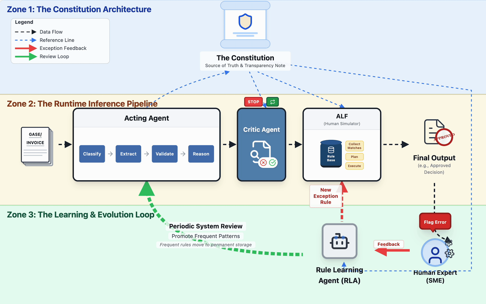

# PO Processing

A purchase-order (PO) document-processing application that combines an
end-to-end inference pipeline with an interactive learning system for continuous
improvement. It runs as a **Dash app** (deployable as a Databricks App), uses
**AWS GovCloud Bedrock** (Anthropic Claude) for all inference, and stores its
data on **Databricks Volumes**.

**Current reference implementation:** Purchase Order processing.

## Overview & Functionalities

### Agent Details

| Property | Value |
|----------|-------|
| **Interface** | Dash web app (Inference + Learning tabs) |
| **Complexity** | Advanced |
| **Agent Type** | Pipeline (Acting → Investigation → ALF) + learning mode |
| **Vertical** | Finance / Document Processing |
| **Inference** | AWS Bedrock Converse API |
| **Models** | Claude Sonnet (heavy reasoning) + Claude Haiku (fast extraction) |
| **Storage** | Databricks Volumes (`VOLUME_BASE`), local-fs fallback for dev |
| **Deployment** | Databricks App (`app.yaml`) |


### Key Features

| Component | Description |
|-----------|-------------|
| **Dual-Mode Prompt** | Single agent supports both Inference and Learning modes, selectable at session start with seamless switching |
| **9-Agent Acting Pipeline** | Classification, extraction, 4-phase validation, transformation, output generation, audit logging |
| **3-Layer Investigation** | Deterministic checks (Layer 1), LLM-powered rule discovery with SHA-256 caching (Layer 2), per-group ultra-conservative validation (Layer 3) |
| **ALF Correction Engine** | Collect-Plan-Execute pipeline: deterministic condition matching (24 operators), scope-based mutual exclusion, hybrid execution (LLM + deterministic) |
| **Impact Assessment** | Evaluates proposed rules against all existing cases to detect collateral matches before committing |
| **Rule Management** | Schema validation, conflict detection, backup on write, ID auto-assignment |
| **Session Logging** | Full audit trail of SME interactions, rule proposals, and approvals |
| **Schema-Driven Eval** | Two-layer evaluation: deterministic field comparison + optional LLM-as-judge |
| **Domain-Agnostic Config** | All domain knowledge in `master_data.yaml` -- swap to adapt to any document type |

### Design Principles

- **Black box acting agent** -- the acting agent is never modified; all evolution happens downstream (ALF, learning)
- **Self-contained agent** -- all data, libraries, and test cases live inside the agent package
- **Layered corrections** -- deterministic rules first, LLM only when needed, human approval always
- **Configuration over code** -- domain knowledge lives in `master_data.yaml`, not in source code
- **Human governance** -- every correction rule requires SME review and approval
- **Backward compatible** -- all components fall back to hardcoded PO defaults when no master data is available

### Tools

**Inference tools (2):**
- `list_inference_cases()` -- discover available cases
- `run_inference(case_id, skip_investigation="true"|"false")` -- run Acting -> Investigation -> ALF pipeline (Investigation is optional)

**Learning tools (16):**
- `list_cases()`, `load_case(case_id)` -- browse and review processed cases
- `discover_safe_rule(case_id, sme_feedback)` -- generate rule with automatic safety loop (validate -> assess impact -> auto-tighten)
- `revise_safe_rule(case_id, rule_json, sme_feedback)` -- revise a rule with the same safety loop
- `build_rule_discovery_context(case_id, sme_feedback)` -- build LLM context for manual rule generation
- `build_rule_revision_context(case_id, rule_json, feedback, impact)` -- build context for manual revision
- `validate_rule(rule_json)`, `check_conflicts(rule_json)` -- schema and conflict checks
- `assess_impact(conditions_json, target_case_id)` -- cross-case impact analysis
- `write_rule(rule_json, mode)`, `delete_rule(rule_id)` -- persist/remove rules in `rule_base.json`
- `get_existing_rules()`, `get_existing_scopes()`, `get_next_rule_id()` -- rule base queries
- `format_rule_display(rule_json)` -- human-readable rule formatting
- `log_session_event(event_type, data_json)`, `save_session()` -- audit logging

### Example Interaction: Inference Mode

```
Agent: Welcome to PO Processing! Which mode would you like to work in?
       (1) Inference -- process cases, or (2) Learning -- review & create rules?

You:   1

Agent: Great, we're in Inference mode.

You:   Run case_002 and case_005, skip the critic

Agent: Inference pipeline completed for case_002:

       Stage 1 -- Acting Agent: ACCEPT (Pending Payment)
         Vendor: Precision Tech Co Pty Ltd | Invoice: INV-00002 ($555.50 AUD)

       Investigation: SKIPPED

       Stage 2 -- ALF: 0 rules evaluated -- output unchanged.

       Final output: data/agent_output/case_002/

Agent: Inference pipeline completed for case_005:

       Stage 1 -- Acting Agent: REJECT
         Vendor: QuickFix HVAC Repairs | Invoice: INV-00005 ($1,069.32 AUD)
         Rejection Phase: Phase 4 (Step 4.3: Labour hours within authorization)
         Rejection Reason: Invoice does not match work authorization
           (Invoice: 2.5h, WAF authorized hours: 0)

       Investigation: SKIPPED

       Stage 2 -- ALF: 0 rules evaluated -- output unchanged.

       Final output: data/agent_output/case_005/
```

### Example Interaction: Learning Mode

The SME reviews case_005. The acting agent rejected at Phase 4 Step 4.3 because the invoice bills 2.5 labour hours but no WAF was submitted to authorize them. The calculations are correct (totals match, GST is 10%) -- this is a work authorization issue, not a calculation error. The SME identifies this as a **policy exception**: emergency maintenance jobs under $2,000 are exempt from WAF requirements per updated procurement policy.

```
You:   Switch to learning

Agent: Switched to Learning mode.

You:   Load case_005

Agent: Case case_005 loaded:

       Decision: REJECT
       Rejection reason: 'Invoice does not match work authorization'
       Failed at: Phase 4, Step 4.3: Labour hours within authorization
         Evidence: Invoice: 2.5h, WAF authorized hours: 0

       Vendor: QuickFix HVAC Repairs (ABN: 51824753556)
       Invoice: INV-00005 ($1,069.32 AUD), dated 2026-02-11
       Line Items: Gasket and seal kit (3 x $219.87) + Technician labour (2.5h x $125)
       Subtotal: $972.11 | GST: $97.21 | Total: $1,069.32
       Has WAF: No (waf_count: 0)

       Validation phases:
         Phase 1 (Intake): CONTINUE (4/4 passed)
         Phase 2 (PO/Invoice): CONTINUE (1/1 passed)
         Phase 3 (Status/Date): CONTINUE (2/2 passed)
         Phase 4 (Totals/EWAF): REJECT (2/3 passed)
           FAILED Step 4.3: Labour hours within authorization

You:   This is an emergency HVAC repair. Our updated procurement policy
       exempts maintenance jobs under $2,000 from the WAF requirement.
       Create a rule to accept these cases.

Agent: Generating rule via discover_safe_rule...

       === Proposed Rule: ALF-001 ===
       Name: WAF Exemption for Emergency Maintenance Under $2,000
       Scope: waf_exemption | Priority: 50

       Conditions:
         1. decision_phase4 equals "REJECT"
         2. phase4.rejection_template contains "work authorization"
         3. invoice.total_amount less_than 2000

       Actions:
         1. set_field
            PO Processing.PO Status = "Pending Payment"
            PO Processing.Rejection Reason = ""
            PO Processing.Rejection Phase = ""

       Metadata:
         Root cause: Policy exception -- updated procurement policy
           not yet reflected in rules book

       Impact Assessment:
         Case case_005: MATCH (target)
         4 other cases: NO MATCH (safe)

       Would you like to approve, revise, or discard?

You:   Add a condition for maintenance service categories only.

Agent: Revising via revise_safe_rule...

       Revised Conditions:
         1. decision_phase4 equals "REJECT"
         2. phase4.rejection_template contains "work authorization"
         3. invoice.total_amount less_than 2000
         4. invoice.service_category in ["HVAC", "ELECTRICAL", "PLUMBING"]

       Impact: case_005 MATCH (HVAC, $1,069.32), 4 others safe.

You:   Approve

Agent: Rule ALF-001 written. Total rules: 1.
```

ALF rules handle **exceptions not covered by the rules book** -- not bugs in the acting agent. They use low-effort deterministic actions (`set_field`) to patch output fields directly without re-running pipeline stages.

---

## Architecture



The diagram above illustrates the three-zone architecture of the PO Processing agent:

- **Zone 1 -- The Constitution Architecture:** The Reconstructed Rules Book serves as the agent's "constitution" -- the single source of truth and transparency. It governs how both the Acting Agent and the Critic Agent (Investigation) behave, ensuring all decisions are traceable back to documented rules.

- **Zone 2 -- The Runtime Inference Pipeline:** An input invoice flows through three sequential stages. First, the **Acting Agent** processes it through a 4-step internal pipeline (Classify, Extract, Validate, Reason). Next, the **Critic Agent** (Investigation) audits the Acting Agent's output against the constitution, with the ability to STOP or allow continuation. Finally, the **ALF engine** (Adaptive Learning Framework) checks its Rule Base for matching correction rules and applies a Collect-Plan-Execute pipeline to produce the final approved output.

- **Zone 3 -- The Learning & Evolution Loop:** When a Human Expert (SME) flags an error in the final output, they provide feedback to the **Rule Learning Agent (RLA)**. The RLA generates a new exception rule that is written into the ALF Rule Base. On subsequent inference runs, the ALF engine automatically applies this correction. Over time, a Periodic System Review promotes frequent exception rules into permanent changes to the Acting Agent itself (green arrow), closing the evolution loop.

```
                 exemplary_data/
                 (input PDFs + ground truth)
                       |
                       v
         +-------------------------------+
         |          PO Processing   |
         |    (Acting → Investigation → ALF)|
         +-------------------------------+
         |                               |
    INFERENCE MODE              LEARNING MODE
         |                               |
    run_inference()          load_case() + SME feedback
         |                               |
    +----+----+----+          discover_safe_rule()
    |    |    |    |                      |
    v    v    v    v          generate -> validate -> assess -> write
  [Act][Inv][ALF] |                      |
   |    |    |    |              rule_base.json
   |    |    |    |              (new/updated rules)
   v    v    v    v                      |
  data/agent_output/          +----------+
  data/alf_output/            |
                              v
                         Next inference run
                         picks up new rules

  ACTING PIPELINE (9 agents):
  PDF -> Classify -> Extract -> Phase1 -> Phase2 -> Phase3 -> Phase4
      -> Transform -> Output -> Audit

  INVESTIGATION (3 layers):
  Layer 1: Deterministic (data source, bypass, tolerance)
  Layer 2: LLM rule discovery (cached by SHA-256)
  Layer 3: Per-group validation (ultra-conservative LLM)

  ALF ENGINE (Collect-Plan-Execute):
  Collect: Evaluate rules deterministically (24 operators, scope exclusion)
  Plan:    Categorize actions into 3 tiers
  Execute: Tier 1 LLM pipeline continuation | Tier 2 LLM field patch | Tier 3 deterministic
```

### Folder Structure

```
invoice-processing/
├── po_processing/                      # Python package (fully self-contained)
│   ├── __init__.py                 # Exports run_inference
│   ├── agent.py                    # run_inference pipeline orchestrator
│   ├── prompt.py                   # Dual-mode instruction prompt
│   ├── tools/
│   │   └── tools.py               # 18 FunctionTools (inference + learning)
│   ├── shared_libraries/
│   │   ├── master_data_loader.py   # Domain config loader
│   │   ├── invoice_master_data.yaml
│   │   ├── alf_engine.py           # ALF correction engine (87 KB)
│   │   ├── acting/
│   │   │   └── general_invoice_agent.py   # 9-agent pipeline (61 KB)
│   │   └── investigation/
│   │       └── investigate_agent_reconst.py  # 3-layer validation
│   ├── core/                       # Learning logic
│   │   ├── config.py               # Central path/LLM configuration
│   │   ├── case_loader.py          # Load processed case artifacts
│   │   ├── impact_assessor.py      # Rule impact analysis across all cases
│   │   ├── rule_writer.py          # Rule validation, conflict detection, persistence
│   │   ├── rule_discoverer.py      # LLM-driven rule generation
│   │   ├── safe_rule_orchestrator.py # Programmatic safety loop for rule discovery
│   │   ├── session_logger.py       # Audit logging
│   │   └── prompts.py             # LLM prompt templates for rule discovery
│   ├── data/                       # Runtime data (inside agent package)
│   │   ├── agent_output/           # Per-case processing artifacts
│   │   ├── alf_output/             # ALF-corrected outputs
│   │   ├── investigation_output/   # Investigation reports
│   │   ├── eval_results/           # Evaluation results
│   │   ├── learning_sessions/      # Session logs
│   │   ├── rule_base.json          # ALF correction rules
│   │   ├── reconstructed_rules_book.md
│   │   └── rule_discovery_cache.json
│   ├── exemplary_data/             # Test cases with PDFs and ground truth
│   │   └── case_001/ ... case_005/
│   └── sub_agents/
├── deployment/
├── eval/
│   ├── eval.py                     # Schema-driven ground truth evaluation
│   └── compare_postprocessing.py   # ALF before/after diff
├── tests/
├── pyproject.toml
├── .env.example
└── README.md                       # This file
```

---

## Setup & Execution

### Prerequisites

- Python 3.10+
- AWS GovCloud credentials with Bedrock model access for the configured Claude
  Sonnet and Haiku model ids
- (For deployment) A Databricks workspace with a Unity Catalog Volume and the
  Databricks Apps feature

### Installation

```bash
# Install dependencies
pip install -e .            # or: uv sync

# Copy and configure environment variables
cp po_processing/.env.example .env
# Edit .env with your AWS region and Bedrock model ids (see below)
```

### Environment Variables

See [`po_processing/.env.example`](po_processing/.env.example) for the full list.

| Variable | Default | Description |
|----------|---------|-------------|
| `AWS_REGION` | `us-gov-west-1` | AWS GovCloud region for Bedrock |
| `BEDROCK_ENDPOINT_URL` | (auto) | Optional explicit Bedrock endpoint override |
| `BEDROCK_SONNET_MODEL_ID` | Claude 3.5 Sonnet | Heavy-reasoning model id |
| `BEDROCK_HAIKU_MODEL_ID` | Claude 3.5 Haiku | Fast extraction/judge model id |
| `BEDROCK_MAX_TOKENS` | `8192` | Max output tokens per call |
| `BEDROCK_MAX_RETRIES` | `5` | Adaptive + backoff retry attempts |
| `BEDROCK_MAX_PDF_BYTES` | `4500000` | PDFs above this skip Bedrock → pdfplumber |
| `VOLUME_BASE` | (unset) | Databricks Volume root; unset = local `data/` |

AWS credentials are resolved by boto3 from the environment / instance profile.

### Running the App (local)

```bash
# Leave VOLUME_BASE unset to use the package-local data/ directory
python app.py
# Open http://127.0.0.1:8050
```

The app has two tabs:

- **Inference** — select an existing case or upload a PDF, then run the
  Acting → Investigation → ALF pipeline and view the decision, per-stage
  detail, final output JSON, and run log.
- **Learning** — load a processed case, discover a correction rule from SME
  feedback, and manage (write / delete) the ALF rule base.

### Deploying as a Databricks App

See [`deployment/README.md`](deployment/README.md). In short: set `VOLUME_BASE`
to your Volume path, provide AWS Bedrock credentials/model ids via Databricks
secrets in [`app.yaml`](app.yaml), seed the Volume with `exemplary_data/`, and
deploy. The app binds `0.0.0.0` on `DATABRICKS_APP_PORT`.

---

## Customization & Extension

### Modifying the Pipeline & UI

| What to change | Where |
|----------------|-------|
| Pipeline stages, gating logic, stage ordering | [`po_processing/agent.py`](po_processing/agent.py) -- edit `run_inference()` |
| Bedrock model selection / Converse request shape | [`po_processing/core/llm_client.py`](po_processing/core/llm_client.py) |
| Data paths / storage backend | [`po_processing/core/storage.py`](po_processing/core/storage.py) |
| Domain schema (fields, validation, output labels) | [`po_processing/shared_libraries/po_master_data.yaml`](po_processing/shared_libraries/po_master_data.yaml) |
| UI layout and tabs | [`po_dash/layout.py`](po_dash/layout.py) |
| UI behavior (run, upload, rule management) | [`po_dash/callbacks_inference.py`](po_dash/callbacks_inference.py), [`po_dash/callbacks_learning.py`](po_dash/callbacks_learning.py) |

### Adding New Backend Functions

The pipeline (`run_inference`) and learning helpers in
[`po_processing/tools/tools.py`](po_processing/tools/tools.py) are plain Python
functions. To surface new behavior in the UI:

1. Add your function to `po_processing/tools/tools.py` (or another module).
2. Import it in the relevant `po_dash/callbacks_*.py` and wire it to a Dash
   `@app.callback` against the appropriate component ids in `po_dash/layout.py`.

### Changing Data Sources

| What to change | How |
|----------------|-----|
| **Domain configuration** | Replace [`shared_libraries/invoice_master_data.yaml`](po_processing/shared_libraries/invoice_master_data.yaml) with your domain's YAML. The `MasterData` class provides typed accessors for 11 sections: document types, extraction schemas, taxonomies, validation pipeline, output schema, eval comparison groups, and more. |
| **Validation rules** | Edit [`data/reconstructed_rules_book.md`](po_processing/data/reconstructed_rules_book.md) -- the "constitution" that the investigation layer validates against. |
| **ALF correction rules** | Edit [`data/rule_base.json`](po_processing/data/rule_base.json) directly, or use Learning mode to create rules interactively. |
| **Test cases** | Add new case folders to [`exemplary_data/`](po_processing/exemplary_data/) with PDFs and optional ground truth `Postprocessing_Data.json`. |

### Adapting to a New Document Domain

1. Create a new `your_domain_master_data.yaml` following the schema in `invoice_master_data.yaml`
2. Replace the acting agent in `shared_libraries/acting/` with your domain's processing pipeline
3. Update `data/reconstructed_rules_book.md` with your domain's validation rules
4. Add test cases to `exemplary_data/`
5. All framework components (ALF, investigation, eval) automatically adapt via the master data configuration -- no code changes needed

---

## Evaluation

The evaluation framework lives in [`eval/`](eval/) and provides schema-driven assessment of agent output quality.

### Methodology

**Two-layer evaluation** (implemented in [`eval/eval.py`](eval/eval.py)):

| Layer | Type | Cost | Description |
|-------|------|------|-------------|
| **Layer 1: Deterministic** | Field-by-field comparison | Free | Compares agent output against ground truth using comparison groups defined in master data. Instant, reproducible, zero cost. |
| **Layer 2: LLM-as-Judge** | Holistic alignment | ~1 API call/case | Single Bedrock (Claude Haiku) call per case producing an overall alignment verdict. Optional (`--skip-llm` to disable). |

### Metrics

- **Field-level match rates** per comparison group (header fields, line items, totals, tax, decision)
- **Decision alignment**: does the agent's ACCEPT/REJECT match ground truth?
- **Financial tolerance**: configurable threshold for numeric comparisons (default: $0.02)
- **LLM verdicts** (when enabled):
  - `ALIGNED` -- output matches ground truth in all material respects
  - `PARTIALLY_ALIGNED` -- correct decision but some field differences
  - `NOT_ALIGNED` -- wrong decision or critical data errors

### Running Evaluations

```bash
# Full evaluation (deterministic + LLM)
uv run eval/eval.py \
    --ground-truth agents/invoice-processing/po_processing/exemplary_data \
    --agent-output agents/invoice-processing/po_processing/data/agent_output

# Deterministic only (no LLM, no cost)
uv run eval/eval.py \
    --ground-truth agents/invoice-processing/po_processing/exemplary_data \
    --agent-output agents/invoice-processing/po_processing/data/agent_output \
    --skip-llm

# Single case evaluation
uv run eval/eval.py --case case_001

# Custom financial tolerance
uv run eval/eval.py \
    --ground-truth agents/invoice-processing/po_processing/exemplary_data \
    --agent-output agents/invoice-processing/po_processing/data/agent_output \
    --tolerance 0.05

# Compare original vs ALF-revised output (before/after diff)
python agents/invoice-processing/eval/compare_postprocessing.py
```

Results are saved to `po_processing/data/eval_results/`.

---

## Deployment

Deploy as a **Databricks App** using [`app.yaml`](app.yaml). See
[`deployment/README.md`](deployment/README.md) for step-by-step instructions and
the cross-cloud (Databricks → AWS GovCloud Bedrock) prerequisites.

---

## Production: Databricks Volumes

In local development, all data lives inside the package (`po_processing/data/`
and `po_processing/exemplary_data/`). In production, set `VOLUME_BASE` to a Unity
Catalog Volume path and the entire data tree relocates there automatically — no
code changes required. Path resolution and all file IO are centralized in
[`po_processing/core/storage.py`](po_processing/core/storage.py); set
`VOLUME_BASE` and every reader/writer follows.

```bash
VOLUME_BASE=/Volumes/<catalog>/<schema>/<volume>
```

### Volume layout (mirrors the local layout)

```
/Volumes/<catalog>/<schema>/<volume>/
├── exemplary_data/                    # Input cases (PDFs); uploads land here
│   ├── case_001/{po.pdf, waf.pdf}
│   └── .../
├── data/
│   ├── agent_output/{case_id}/...     # Per-case pipeline artifacts
│   ├── alf_output/{case_id}/...       # ALF-corrected outputs
│   ├── investigation_output/          # Investigation reports
│   ├── eval_results/                  # Evaluation results
│   ├── learning_sessions/             # SME session logs
│   ├── rule_base.json                 # ALF correction rules (user-facing)
│   ├── reconstructed_rules_book.md    # Validation rules constitution
│   └── rule_discovery_cache.json      # Cached rule discovery
```

Seed the Volume once by copying the shipped `exemplary_data/` (and an empty
`data/` tree) into it. Because Databricks Volumes are POSIX-mounted, the standard
`pathlib`/`open()` IO in `storage.py` works directly; swap the backend there if a
non-POSIX store is ever needed.

> **Note:** the app is single-instance, so writes to shared files
> (e.g. `rule_base.json`) are not locked.

---

## Sample Test Cases

The agent ships with sample purchase-order cases in `exemplary_data/`:

| Case | Vendor | Total | Acting Decision | Phase | Scenario |
|------|--------|-------|-----------------|-------|----------|
| case_001 | FastTrack Logistics | $733.70 | REJECT | Phase 3 | Vendor tax ID invalid |
| case_002 | Precision Tech Co Pty Ltd | $555.50 | ACCEPT | -- | Preventative maintenance, 3 line items, all valid |
| case_005 | QuickFix HVAC Repairs | $1,069.32 | REJECT | Phase 4 | Labour hours not authorized -- no WAF submitted (Step 4.3) |
